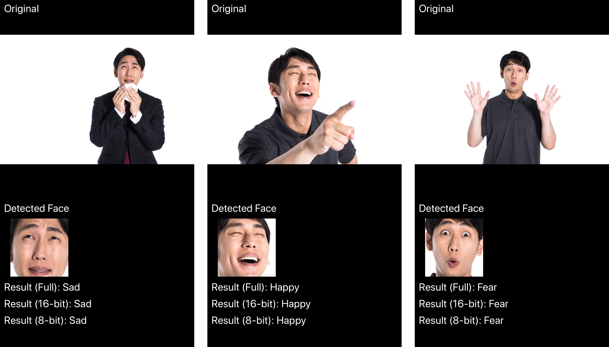

# iOSMLBook

技術書「[Core ML Tools実践入門](https://shu223.booth.pm/items/1723495)」のサンプルコードです。

## 書籍の概要

本書はCore ML Toolsの実践入門書です。
KerasやTensorFlowを用いて構築した機械学習／ディープラーニングのモデルをiOSで利用するために必要な変換ツールである「Core ML Tools」（Pythonパッケージ名としては`coremltools`）の利用方法を**さまざまなモデルをつくりながら**学んでいきます。

最初はわずか2行のコードで変換することからはじめてCore ML Toolsに入門しつつ、もっと高度な変換方法や、モデルのサイズを縮小する方法、パイプラインを構築する歩法、オンデバイスで学習できるようにする方法等も解説していきます。

また巻末には「逆引きリファレンス」も収録しています。開発の現場で「どう書くんだっけ？」となったときに大いに役立つことでしょう。

A5版、本文164ページ。

## 目次

第1章 準備

- 1.1 Core ML Toolsとは
- 1.2 Core ML Toolsの環境構築

第2章 Core ML Toolsはじめの一歩

- 2.1 2行のコードで学習済みモデルをロードする
- 2.2 2行のコードでCore MLモデルに変換する
- 2.3 変換したモデルを.mlmodelファイルとして保存

第3章 Core MLモデル作成の基礎

- 3.1 HDF5ファイルを読み込む
- 3.2 Core MLモデルに変換する
- 3.3 Core MLモデルの入力の型を変更する
- Core MLモデルから自動生成されるSwiftコード
- Visionはどのように画像分類モデルを判定するか？

第4章 オンデバイス学習 - UpdatableなCore MLモデルの作成

- 4.1 モデルのパーソナライゼーション
- 4.2 ベースとなるモデルの作成
- 4.3 Updatableなモデルに変換する
- 4.4 損失関数をセットする
- 4.5 最適化アルゴリズムをセットする
- 4.6 エポック数をセットする
- 4.7 モデルを保存する

第5章 オンデバイス学習 - iOSで学習

- 5.1 MLUpdateTask
-- 5.1.1 mlmodelc
-- 5.1.2 MLBatchProvider, MLArrayBatchProvider
-- 5.1.3 MLTask
-- 5.1.4 オンデバイスモデル更新タスクの全体感
- 5.2 学習データの準備
- 5.3 学習タスクの実行
- 5.4 オンデバイスで学習したモデルを保存する / MLUpdateContext, MLWritable
- 5.5 推論処理の実行

 
(On-Device Training)

第6章 TensorFlowモデルの変換 - 基礎編

- 6.1 tfcoreml
- 6.2 tfcoremlを用いたCore MLモデルへの変換（最小実装）
-- 6.2.1 学習済みモデル(.pbファイル)を読み込む 
-- 6.2.2 出力テンソルの名前を取得する 
-- 6.2.3 tfcoremlを用いて変換する 
- 6.3 より扱いやすいCoreMLモデルに変換する
-- 6.3.1 クラスラベルを指定する
-- 6.3.2 入力の型を画像に変更する
- 6.4 iOSで推論を実行 
- 6.5 入力画像の前処理を指定する

第7章 TensorFlowモデルの変換 - 画風変換モデル

- 7.1 学習済みモデルからグラフ定義を読み込む
- 7.2 変換に必要なグラフの情報を取得する
-- 7.2.1 入力テンソルの名前を取得する
-- 7.2.2 出力テンソルの名前を取得する
- 7.3 tfcoremlを用いて変換する
-- 7.3.1 入力テンソルのshapeを指定する
- 7.4 Core MLモデルの出力の型を変更する
- 7.5 iOSで画風変換を実行
-- 7.5.1 複数の入力を持つCore MLモデルをVisionで使う
-- 7.5.2 出力画像を取得する

 
(Style Transfer - Pre-trained models conversion)

第8章 Flexible Shape - 超解像モデル

- 8.1 Flexible Shapeとは/使いどころ
- 8.2 超解像モデルをCore MLモデルに変換する
- 8.3 Flexible Shapeを適用する
- 8.4 iOS側での推論処理の実行

 
(Super Resolution - Flexible Shapes)

第9章 Core MLモデルのサイズを小さくする

- 9.1 本章で利用する感情認識モデルについて
- 9.2 重みを16ビット化する
-- 9.2.1 16ビット化が推論結果の精度に与える影響
-- 9.2.2 Core MLモデルを16ビット化する手順
- 9.3 クォンタイズ
- 9.4 iOSでの推論結果の比較
- 9.5 さらなるモデルサイズ削減
-- 9.5.1 ルックアップテーブルを利用した量子化
-- 9.5.2 モデルの一部を共通化

 
(Emotion Recognition - Quantization)

第10章 パイプラインモデルとリンクモデル(Linked Model)

- 10.1 パイプラインの構築
-- 10.1.1 coremltools.models.pipelineモジュール
-- 10.1.2 PipelineClassifierオブジェクトの生成
-- 10.1.3 パイプラインにモデルを追加
-- 10.1.4 MLModel オブジェクト生成
- 10.2 リンクモデル(LinkedModel)
-- 10.2.1 リンクモデルとは/リンクモデルを使用するメリット
-- 10.2.2 パイプラインとリンクモデル
-- 10.2.3 リンクモデルの作成方法
- CreateMLのモデルはなぜ小さいのか
-- CreateMLとパイプライン
-- Vision FeaturePrint

第11章 モデルの可視化

- 11.1 Netron
- 11.2 coremltoolsのvisualize_spec
- 11.3 TensorBoard
-- 11.3.1 TensorFlowモデルのグラフを可視化
-- 11.3.2 Kerasでの学習状況を可視化
- 11.4 Kerasのplot_model

第12章 mlmodelファイルフォーマット

- 12.1 mlmodelファイルフォーマットを理解するメリット
- 12.2 .protoファイルの読み方
- 12.3 coremltoolsとprotobuf
- 12.4 protobuf API

付録A coremltools逆引きリファレンス

- A.1 MLModelオブジェクトを生成する
-- .mlmodelファイルから生成する
-- spec（Model_pb2.Model）から生成する
- A.2 モデルのspec（Model_pb2.Model）を取得する
-- .mlmodelファイルから取得する
-- MLModelオブジェクトから取得する
- A.3 .mlmodelファイルの保存・読み込み
-- .mlmodelファイルを読み込む
-- .mlmodelファイルとして保存する
- A.4 NeuralNetworkBuilderを生成する
- A.5 モデルの中身を調べる
-- モデルを可視化（ビジュアライズ）する
-- モデルのバージョン（Specification Version）を確認する
-- モデルのdescriptionをログに出力する
-- ネットワークの情報をログに出力する
-- NeuralNetworkBuilderでモデルの入力・出力形式を確認する
-- モデルのレイヤー一覧を出力する
-- モデルの中間層の入出力形式を調べる
- A.6 Core MLモデルにクラスラベルを与える
-- ラベル文字列の配列を渡す
-- クラスラベルファイルのパスを渡す
- A.7 モデルの入力・出力をカスタマイズする
-- 入力・出力名を指定する
-- 変換時に入力の型を画像型にする
-- 変換済みモデルの入力・出力の型を画像型にする
-- 入力テンソルのshapeを指定する
-- 入力画像の前処理を指定する
- A.8 モデルサイズを圧縮する
-- 重みを16ビット(半精度)化する
-- 重みをクォンタイズする
- A.9 オンデバイス学習関連
-- モデルがUpdatableかどうかを調べる
-- Updatableなレイヤー一覧を出力
-- Updatableなモデルに変換する
-- 学習で使用する損失関数をセットする
-- 損失関数のサマリを確認する
-- 学習で使用する最適化アルゴリズム（オプティマイザ）をセットする
-- 最適化アルゴリズムを確認する
-- エポック数をセットする
- A.10 FlexibleShape関連
-- FlexibleShapeの適用可否を確認する
-- 入力・出力の画像サイズを範囲で指定する
-- 入力・出力に複数の画像サイズを指定する
- A.11 misc.
-- 利用中のcoremltoolsのバージョンを確認する

付録B Keras入門

- B.1 Kerasとは
-- B.3 tf.kerasとスタンドアロン版Keras
- B.1 Kerasでカスタムモデル作成
-- B.1 モデルのネットワークを定義する
-- B.2 モデルのコンパイル
-- B.3 モデルの学習
-- B.4 モデルの評価
-- B.5 モデルの保存
