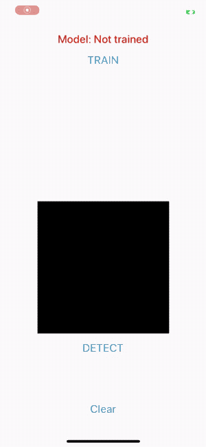

# iOSMLBook

技術書「[Keras & Core ML Tools](https://shu223.booth.pm/items/1723495)」のサンプルコードです。

## 書籍の概要

Keras/TensorFlowでモデルを構築・学習し、Core ML Toolsで変換、iOSアプリに組み込んで推論処理を行うまでの一連の流れを解説した書籍です。

入門としてのシンプルなカスタムモデルの構築から、Core ML 3の目玉機能である「オンデバイス学習」（モデルの更新をiOS側で行う）まで解説しています。

 
(On-Device Training)

## 目次

第1章 Kerasの基礎

- 1.1 Kerasとは
- 1.2 Core ML Tools
- 1.3 KerasとCore ML Tools
- 1.4 tf.kerasとスタンドアロン版Keras
- 1.5 Keras/TensorFlow/Core ML Toolsの環境構築
- 1.6 KerasでHello world

第2章 Keras & Core ML Tools入門

- 2.1 2行のコードで学習済みモデルをロードする
- 2.2 Core MLモデル形式に変換する
- 2.3 変換したモデルを.mlmodelファイルとして保存
- 2.4 保存したCore MLモデルファイルをXcodeで確認する

第3章 Kerasでカスタムモデル作成 - モデルの構築

- 3.1 モデルのネットワークを定義する
  - 3.1.1 Sequential モデル(とKeras functinal API)
  - 3.1.2 Conv2D
  - 3.1.3 MaxPooling2D
  - 3.1.4 Dropout
  - 3.1.5 Flatten
  - 3.1.6 Dense
  - 3.1.7 モデルのサマリを確認
- 3.2 モデルのコンパイル
  - 3.2.1 損失関数
  - 3.2.2 最適化アルゴリズム
  - 3.2.3 評価関数

第4章 Kerasでカスタムモデル作成 - モデルの学習

- 4.1 データの準備
- 4.2 データの整形
- 4.3 学習
- 4.4 評価
- 4.5 モデルの保存

第5章 Kerasでカスタムモデル作成 - Core MLモデルへの変換

- 5.1 Core ML Toolsで.mlmodelに変換する
- 5.2 Core MLモデルの入力の型を変更する
- Core MLモデルから自動生成されるSwiftコード

第6章 Kerasでカスタムモデル作成 - iOSで推論を実行

- 6.1 作成したCore MLモデルをプロジェクトに追加する
- 6.2 VNCoreMLModelの初期化
- 6.3 VNCoreMLRequestの作成
- 6.4 VNImageRequestHandlerの作成/推論処理の開始
- 6.5 推論結果の処理
  - Visionはどのように画像分類モデルを判定するか？

第7章 オンデバイス学習 - UpdatableなCore ML モデルの作成

- 7.1 モデルのパーソナライゼーション
- 7.2 UpdatableなCore MLモデルに変換する
  - 7.2.1 ベースとなるモデルの作成
  - 7.2.2 モデルの現状を確認
  - 7.2.3 Updatableなモデルに変換する
  - 7.2.4 損失関数をセットする
  - 7.2.5 最適化アルゴリズムをセットする
  - 7.2.6 エポック数をセットする
  - 7.2.7 モデルを保存する

第8章 オンデバイス学習 - iOSで学習

- 8.1 MLUpdateTask
  - 8.1.1 mlmodelc
  - 8.1.2 MLBatchProvider, MLArrayBatchProvider
  - 8.1.3 MLTask
  - 8.1.4 オンデバイスモデル更新タスクの全体感
- 8.2 学習データの準備
  - 8.2.1 MNISTデータセットをプロジェクトに追加する
  - 8.2.2 学習データからMLArrayBatchProviderオブジェクトを作成する
- 8.3 学習タスクの実行
- 8.4 オンデバイスで学習したモデルを保存する / MLUpdateContext, MLWritable
- 8.5 推論処理の実行